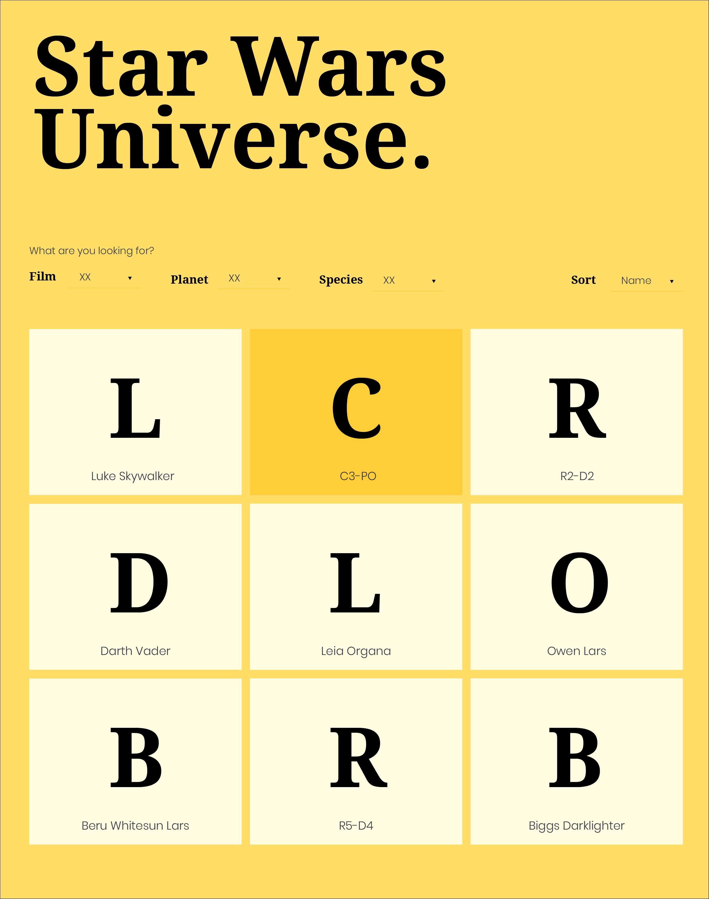
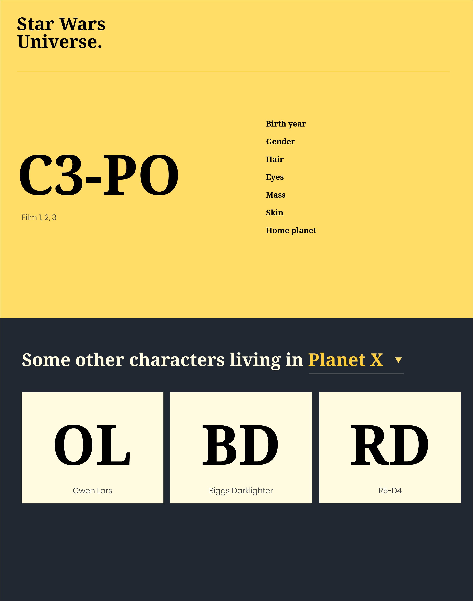
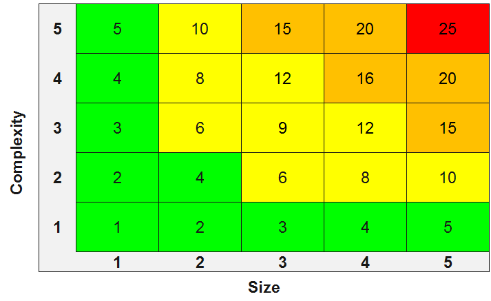

## Workshop Objectives

Build an application using the star wars open api using your prefered tools and by trying finish the time deadline with the agreed functionality.

**Non negotiables**
- Pages should be responsive
- Pages should have error handling
- Pages should have a loading state if needed

### Requirements
- Home page should load the list of characters
- Home page should be able to sort names ascending/descending
- Home page should be able to filter list by film, planet or species
- Detail page should show relatable information based on their type:
- - Character shows others living in their same planet
- - Films shows other characters in the film
- - Planets shows other characthers living there
- - Species shows other characters of the same species
- Deployed website

### Bonus
- Add search by name or title in homepage
- Add a selector to be able to display films, planets, species or characters
- Add end to end tests 

### References

Star Wars Open API - https://www.swapi.tech/documentation#people




### Estimation



## Getting Started

First, run the development server:

```bash
npm run dev
# or
yarn dev
# or
pnpm dev
# or
bun dev
```

Open [http://localhost:3000](http://localhost:3000) with your browser to see the result.

You can start editing the page by modifying `app/page.tsx`. The page auto-updates as you edit the file.

This project uses [`next/font`](https://nextjs.org/docs/app/building-your-application/optimizing/fonts) to automatically optimize and load [Geist](https://vercel.com/font), a new font family for Vercel.

